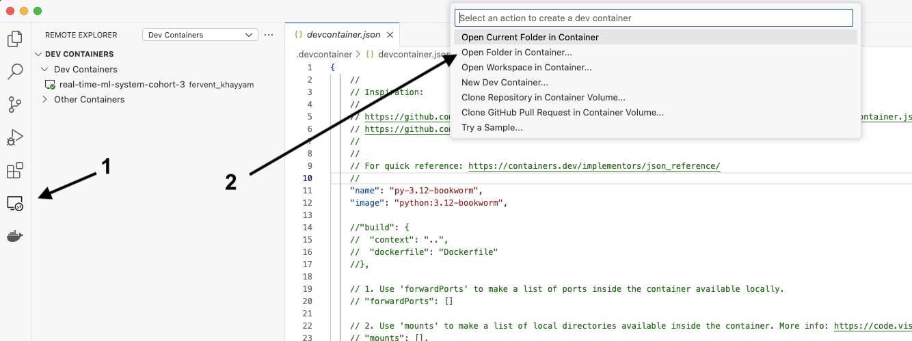

## Building a (better) Real Time ML System. Together

### Table of contents
- [What is this course about?](#what-is-this-course-about)
- [Sessions](#sessions)
- [Tooling](#tooling)

### What is this course about?

We build and deploy a real time ML system that predicts short-term crypto prices.
We build from scratch, step by step, covering the entire ML system development process.
So you become an ML ninja.

### Sessions

- [Session 1](./sessions/session_1.md)
- [Session 2](./sessions/session_2.md)
- [Session 3](./sessions/session_3.md)
- [Session 4](./sessions/session_4.md)
- [Session 5](./sessions/session_5.md)
- [Session 6](./sessions/session_6.md)
- [Session 7](./sessions/session_7.md)
- [Session 8](./sessions/session_8.md)
- [Session 9](./sessions/session_9.md)
- [Session 10](./sessions/session_10.md)
- [Session 11](./sessions/session_11.md)
- [Session 12](./sessions/session_12.md)


### Tooling

Python development environment in a devcontainer.
Uses [VSCode](https://code.visualstudio.com/) and [Devcontainers](https://containers.dev/)

> **Note:**
>
> During our live sessions we did not use devcontainers. Instead, we installed all the tools
> we needed manually, including:
>
> - `make`
> - `docker`
> - `docker-compose`
> - `uv`
> - ...
>
> As many of you (especially on Windows) have had troubles reproducing this development
> enviroment, we will use devcontainers from day 0 in our next cohort.

> Special thanks to Marius Rugan for the devcontainer setup 🙌 you can find in this repo,
> which I recommend you use especially if you are on Windows.


#### Generic Tooling

- [pre-commit](https://pre-commit.com/)
- [direnv](https://direnv.net/)
- [editorconfig](https://editorconfig.org/)
- a devcontainer based on ```python:3.12-bookworm```
- devcontainer related extensions in VSCode

#### Python Tooling

- [uv](https://github.com/astral-sh/uv)
- - [pyproject.toml](https://docs.astral.sh/uv/guides/projects/#pyprojecttoml)
- - [.venv](https://docs.astral.sh/uv/guides/projects/#venv)
- - [uv.lock](https://docs.astral.sh/uv/guides/projects/#uvlock)
- [ruff](https://docs.astral.sh/ruff/)
- uv build subsystem powered by [hatch](https://github.com/pypa/hatch)

#### Tooling cheatshet

```sh
pre-commit install
```

```sh
uv sync
```

#### Starting the devcontainer

1. Download VSCode, open the root folder of this project and setup extensions following automatic suggest coming from ```.vscode/recommendations.json```

2. Clone git repo and open directory in VSCode. It should prompt you to open folder in devcontainer.
The container is build & started locally, and you'll develop inside it as if it's your local machine, in sync with your local folder.

3. Open the folder in a devcontainer.



You are ```root``` inside the cointainer.
Verify that you can write files with ```touch test.txt```.

#### development workflow

To be added
